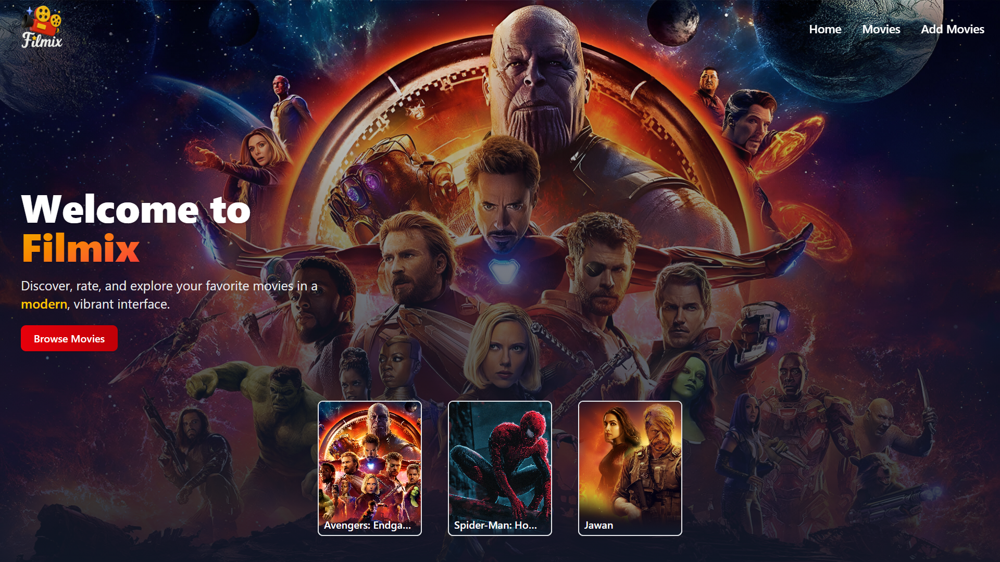

# [Filmix](https://filmix-7ub7.onrender.com)

This is a simple full-stack web application that allows users to browse and search for movies. The application is built using React for the frontend and Node.js with Express for the backend.

> This may take 1-2 minutes to load on first render since I'm using free-plan of onrender to host our backend server. It goes to sleep after 15 minutes of inactivity.

visit the [live demo](https://filmix-7ub7.onrender.com) 👈🏻.

## Features

- **Browse Movies:** View a collection of movies with beautiful cards and poster galleries.
- **Search:** Instantly search movies by title, description, category, or director.
- **Add Movies:** Add new movies with images, description, category, director, release year, and rating.
- **Edit Movies:** Update movie details and images.
- **Rate Movies:** Interactive star rating system for each movie.
- **Delete Movies:** Remove movies (except protected default movies).
- **404 Page:** Custom themed not-found page for unmatched routes.
- **Responsive Design:** Fully responsive and mobile-friendly.
- **Modern UI:** Themed with red, yellow, white, and gray using TailwindCSS.

## Tech Stack

- **Frontend:** React, React Router, TailwindCSS, React Icons, Lucide React, React Hot Toast, Axios, Vite
- **Backend:** Node.js, Express, Mongoose, MongoDB, dotenv, CORS
- **Other:** Nodemon

## Contact

*For any inquiries or feedback, please contact:*

#### Ravikant Tarare

📩 [ravikanttarare2001@gmail.com](mailto:ravikanttarare2001@gmail.com)

📞 [+91-8275957698](tel:+918275957698)
